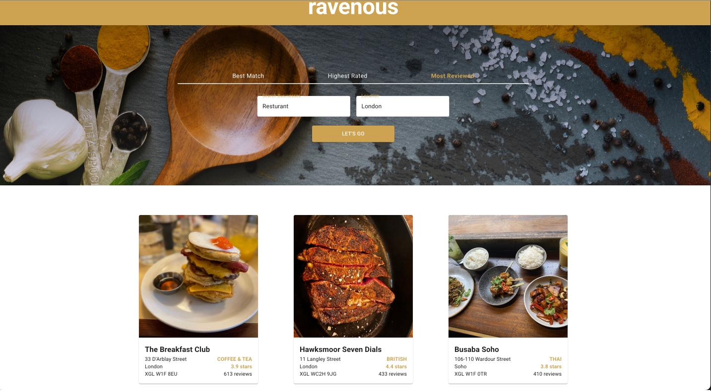
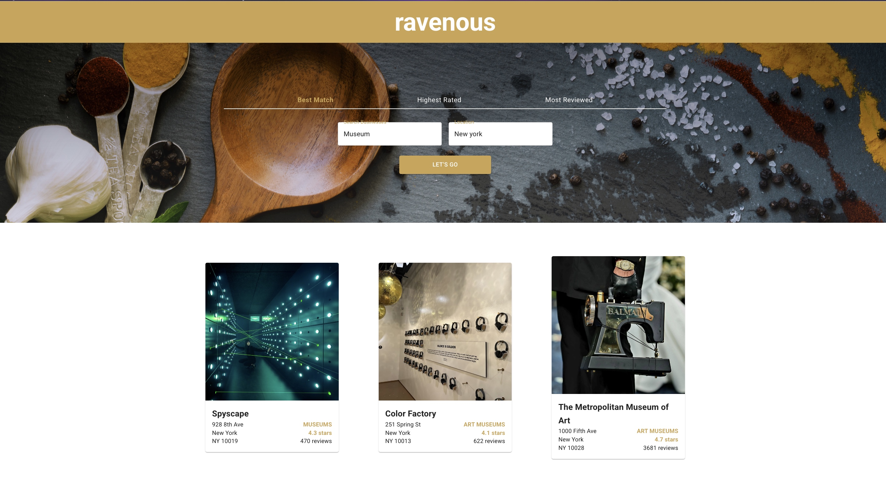
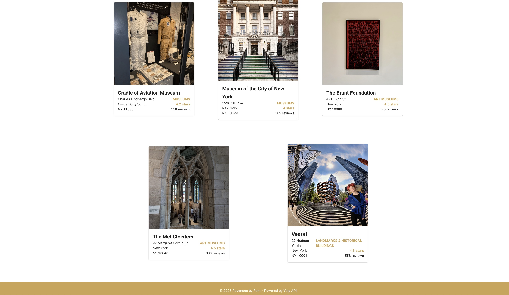
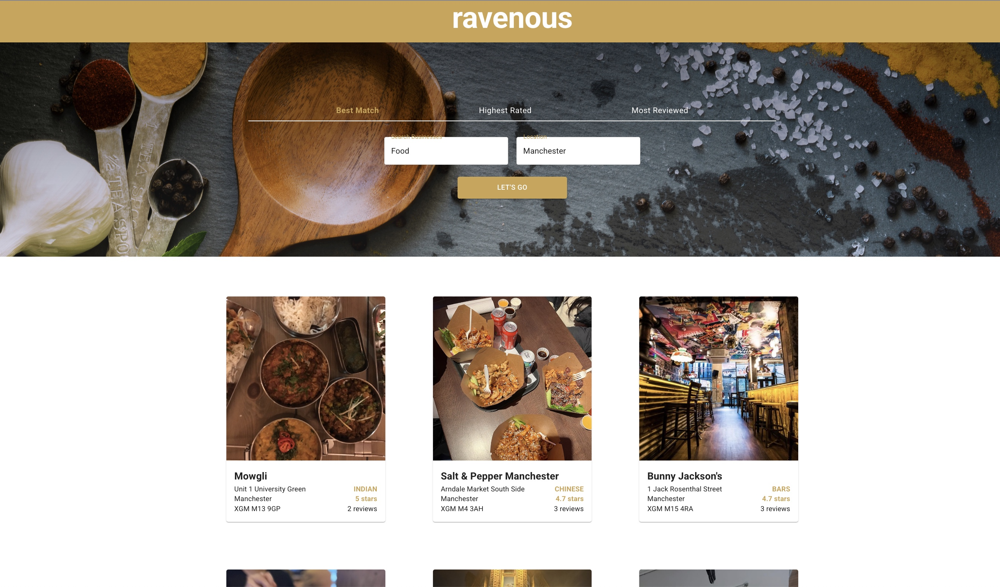

# 🌍 WorldWise React App

Ravenous is a React-based web application that lets users search for businesses by name and location using the Yelp API. Whether you're looking for a pizza place in New York or a coffee shop in London, Ravenous fetches real-time business listings, user reviews, ratings, and images.

## 🔗 Live Demo

https://react-worldwise-tzde.onrender.com

## 📦 Features

- 🔎 Search for businesses by keyword and location
- 📍 View top-rated business listings from Yelp
- 🖼️ Displays images, ratings, and review counts
- 💡 Responsive design for both desktop and mobile views
- ♻️ Clean component structure using React functional components
- ⚙️ Backend Express server with environment-based API key protection

## 🚀 Tech Stack

- Frontend: React, Vite, MUI
- Backend: Node.js, Express
- API: Yelp Fusion API
- Styling: CSS Modules, Material UI
- Development: ESLint, dotenv

## 💻 Using the application on your local system

- Clone the repository : git clone https://github.com/lumidee007/ravenous
- Change directory: cd ravenous
- Install dependencies : npm install
- Create a .env file in the server/ directory: YELP_API_KEY=your_yelp_api_key
- cd server : npm run dev
- cd .. : npm run dev
